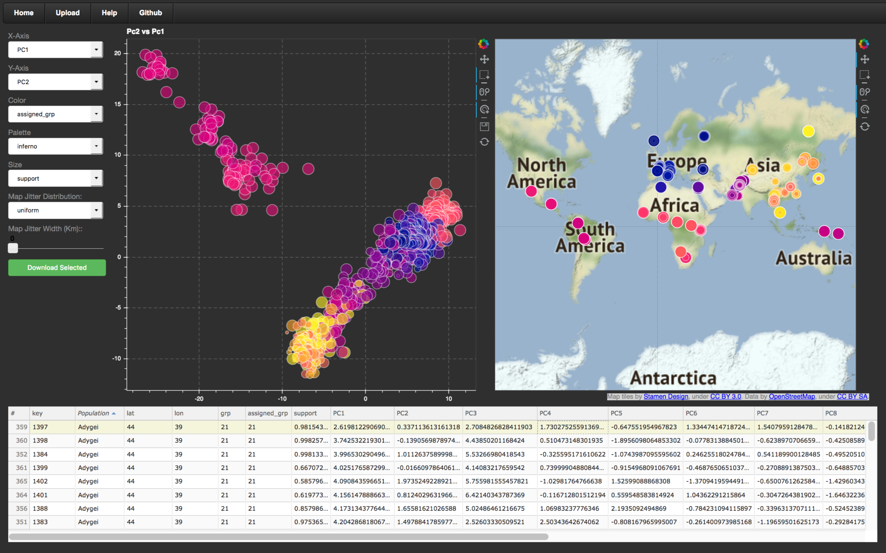
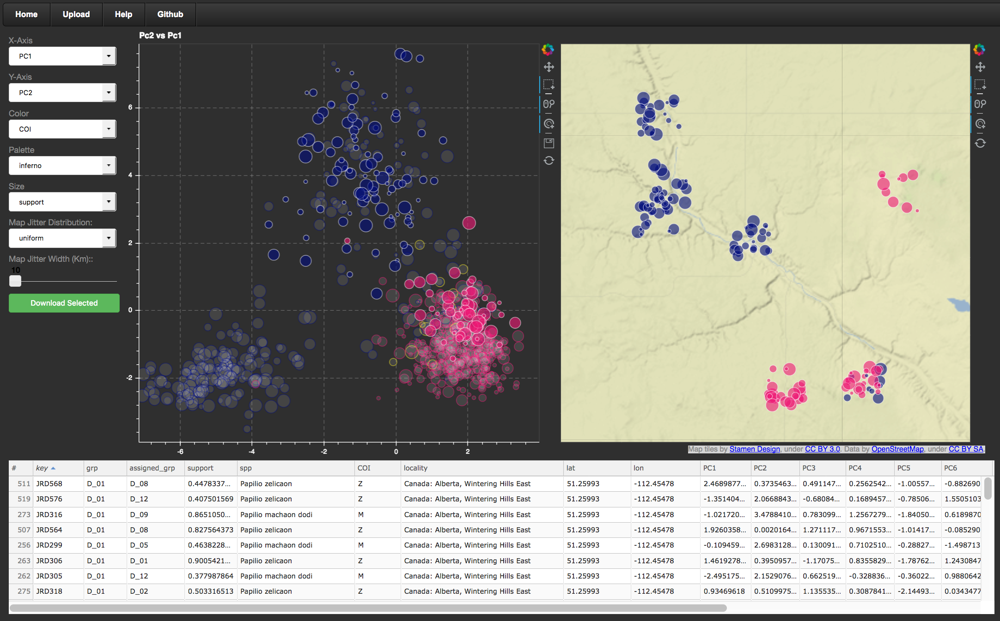

Try a hosted instance of mvMapper **[Here](http://ctahr-peps.colo.hawaii.edu/)!**
 

 

**mvMapper** (Multivariate Mapper) is an interactive data exploration tool for multivariate analyses with associated geographic location information. Although we developed mvMapper with population genetic data in mind, it will ingest results of virtually any multivariate analysis of georeferenced data. mvMapper’s greatest strength is facilitating dynamic exploration of the statistical and geographic frameworks side-by-side, a task that is difficult and time-consuming to do in static space. It displays a scatterplot with selectors for x-axis, y-axis, point color, point size, and color pallet in addition to a world map with optional jitter to separate overlapping points. Data selections are linked across the two plots, and a data table below shows details of the selected data, which can also be downloaded as a csv.

### Hosted Example

A hosted instance of **mvMapper** is available [Here](http://ctahr-peps.colo.hawaii.edu/). See the corresponding [help](http://ctahr-peps.colo.hawaii.edu/help) page for usage instructions. **Note**, the web app loads slowly on some internet connections. If all you see is a grey screen and the navigation bar, give it a moment!

### Stand-alone Use

**mvMapper** is also deployable from source code or a Docker container. Details can be found [Here](https://github.com/popphylotools/mvMapper)

If you use this tool for your research, please cite the paper describing mvMapper published in [Molecular Ecology Resources](http://onlinelibrary.wiley.com/doi/10.1111/1755-0998.12724/abstract)
